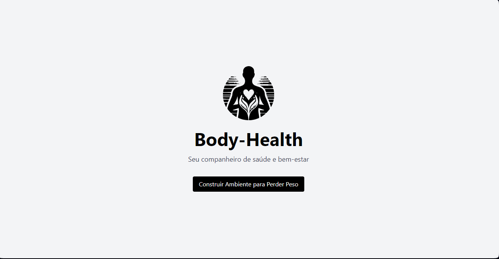
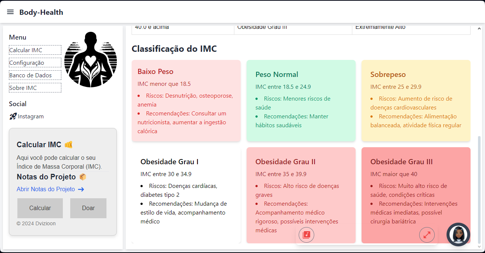
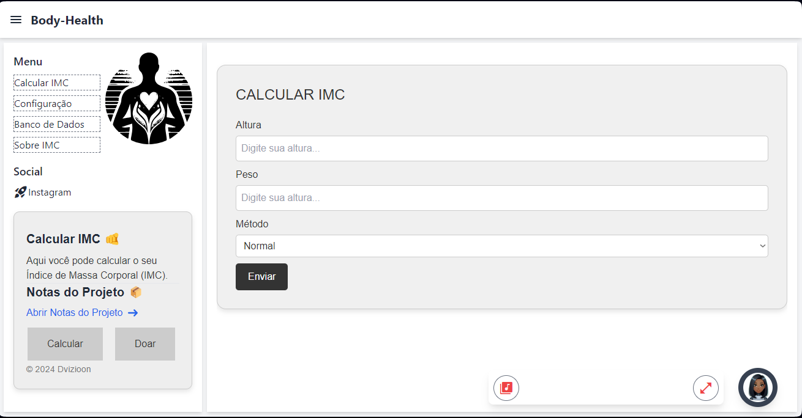
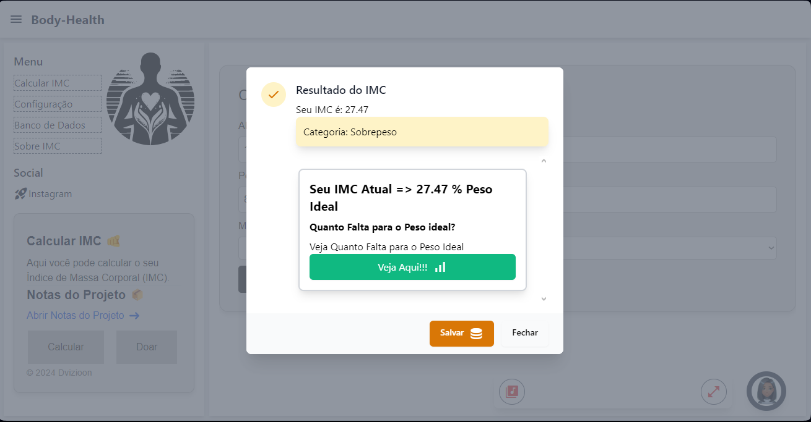
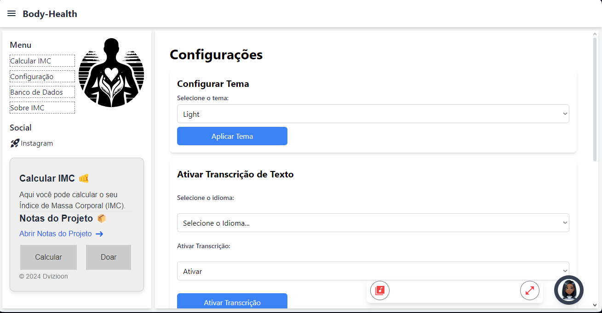
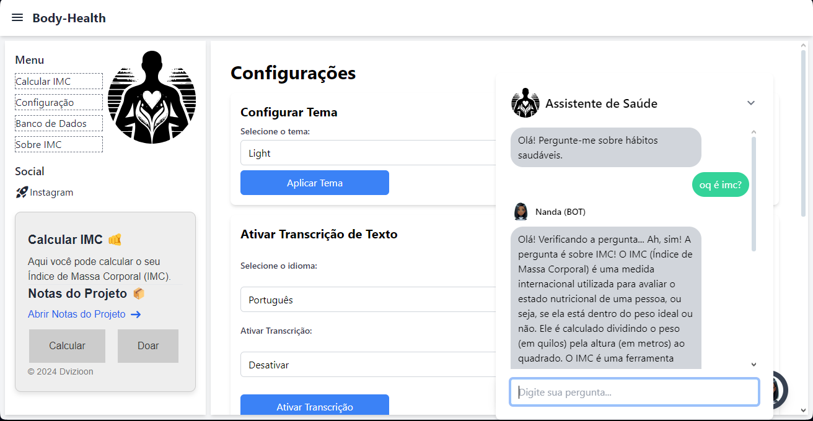
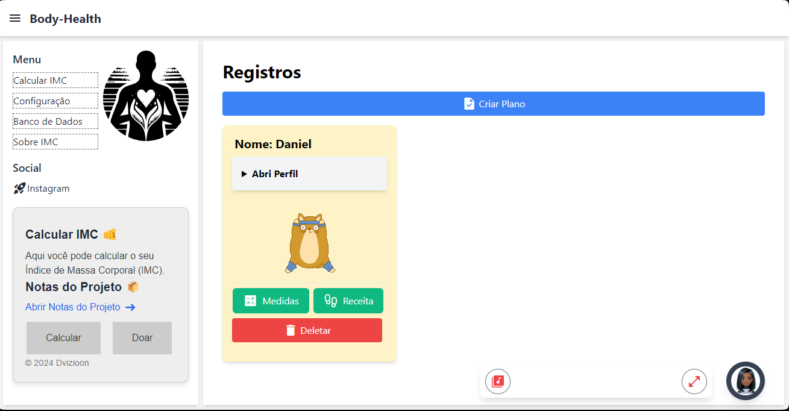

# Body-health



Este projeto é uma aplicação web desenvolvida em Python utilizando o framework Flask para calcular o Índice de Massa Corporal (IMC) 🍃. A aplicação possui componentes customizados e inclui uma IA 🤖 criada por você para calcular o IMC de forma inteligente. Além disso, utilizamos um banco de dados SQLite com estrutura em JSON para armazenar os dados dos usuários.

## Funcionalidades

- **Cálculo de IMC:** Permite aos usuários inserir seus dados (altura e peso) para calcular o IMC.
- **Interface Customizada:** Componentes da interface do usuário personalizados para melhorar a experiência do usuário.
- **Metodo e Escolhas:** Com Base na Escolha é possivel definir o tipo de processamento do servidor.
- **IA para Cálculo de IMC:** Utiliza uma IA desenvolvida para calcular o IMC de forma precisa e fornecer recomendações personalizadas.
- **Roteamento:** Implementação de roteamento no Flask para gerenciar as diferentes páginas da aplicação.
- **Banco de Dados SQLite:** Armazenamento de dados dos usuários utilizando SQLite com estrutura em JSON.



## Tecnologias Utilizadas

- **Python:** Linguagem de programação principal utilizada no projeto.
- **Flask:** Framework web utilizado para construir a aplicação.
- **HTML/CSS/JavaScript/Jquery:** Tecnologias front-end para criar a interface do usuário.
- **SQLite:** Banco de dados utilizado para armazenar informações dos usuários.
- **JSON:** Formato de armazenamento de dados no banco de dados.
- **OPENIV (Engenharia Social):** Implementação de uma IA para cálculos e recomendações de Atividades fisicas e Alimentação.
> [!CAUTION]
>Observação o PHI-3 é um novo modelo generativo de IA, então será necessário 🫵 baixar: https://ollama.com/library/phi3


> - **IA (PHI-3):** Implementação de uma IA para dar recomendações. 

> [!CAUTION]
> Uma "(IA - Inteligência Artificial)" Não substitui a orientação de um profissional real.


## Estrutura do Projeto

```bash
SISTEMA-IMC/
│
├── main.py
├── templates/
│ ├── ...
├── configuration/
│ ├── ...
├── Assets/
│ ├── ...
├── custom/
│ ├── ...
├── auth/
│ ├── ...
├── database/
│ ├── ...
├── Modules/
│ ├── ...
├── Plugins/
│ ├── ...
├── Router/
│ ├── ...
│
└── README.md 

```

## Configuração de AI:

```python
   def modelAI():
      Ai = LerYaml(".Yaml","openAI",index=0)
      
      if Ai == "OpenIV":
         return openVision()
      elif Ai == "PHI3":
         return jsonify({
            "Model => PHI-3":"404" , 
            "Disponiveis":"*OpenAi",
            "Instalar":"https://ollama.com/library/phi3"
         })

```
- Para Você implementar um nova AI com mais otimização você pode usar essa funçao para retonar as infomações coletadas nos componentes 

> ![NOTE]
> Observer que o Modelo principal é o Arquivo `Components/OpenIV/index.py`

## Usando Micro Serviço API
```bash

-> `Usando o (ask)`
{
    "altura": 170,
    "peso": 70,
    "imc": 24.2,
    "tipo": "ask",
    "question": "Oq é IMC?"
}

-> `Usando o (refeicao)`

{
    "altura": 170,
    "peso": 70,
    "imc": 24.2,
    "tipo": "refeicao",
}

-> `Usando o (atividadeFisica)`
{
    "altura": 170,
    "peso": 70,
    "imc": 24.2,
    "tipo": "atividadeFisica",
}

```

## Sistema de Roteamento

```python

import sys
sys.path.append(".")

def RouterLink( url , method , function=False):
    
    '''
        @url = equivale ao path da metaLink ex: /home
        @method = equivale ao tipo de processamento ex: [get,post,delete,patch,put]
        @function = função que a rota recebe ex: rende_home
        
        isso Sera o Equivalente há:
                @app.route(</nome_link/>, methods=[</ metodos />])
                    def </nome_function/>:
                        ...
    '''
    
    routes = [
        {'url': url, 'method': method, 'function': function},  
    ]
    
    return routes
#Exemplo de uso do retorno
# def Home():
#     print("Bem Vindo Rota /Home")
# RotaHome = RouterLink("/",["GET"],Home)
# print(RotaHome)

```

## GTTS

```python
def create_sound_api(texts):
    url_audio = f"{LerYaml('.Yaml','server',index=0)}://{LerYaml('.Yaml','configuration',index=0)}:{LerYaml('.Yaml','configuration',index=1)}/api/audios"
    data = {'texts': texts}
    headers = {'Content-Type': 'application/json'}

    try:
        response = requests.post(url_audio, data=json.dumps(data), headers=headers)
        response.raise_for_status() 

        audio_data = response.json()
        return audio_data

    except requests.exceptions.RequestException as e:
        print("Erro ao fazer a solicitação:", e)
        return None
--------------------------------------------------------------
audio_files = {}  
def createSound():
    data = request.get_json()
    texts = data.get('texts', [])

    if not texts:
        return jsonify({"error": "No texts provided"}), 400

    for i, text in enumerate(texts):
        audio_fp = create_sound(text)
        key = f"audio_{i + 1}"
        audio_files[key] = audio_fp

    response = {key: f"/api/audio/{key}" for key in audio_files.keys()}
    return jsonify(response)
---------------------------------------------------------------
def getSound(audio_key):
    audio_fp = audio_files.get(audio_key)
    if audio_fp:
        audio_fp.seek(0)
        return send_file(audio_fp, mimetype="audio/mpeg")
    else:
        return jsonify({"error": "Audio not found"}), 404
    

```

## Usando Micro Serviço Som
```bash
`Request`
{
  "texts": [
    "Dvizioon","Olá Tudo bem?"
    ]
  
}

`Response`

{
  "audio_1": "/api/audio/audio_1",
  "audio_2": "/api/audio/audio_2"
}

```

> [!CAUTION]
>Observação: /roteamento {"url": f"/api/audio/<audio_key>", "method": ["GET"], "function":getSound} => MimeType:audio/mpeg


## Instalação do Projeto

1. **Clone o repositório:**
   ```bash
   git clone https://github.com/dvizioon/SISTEMA-IMC
   cd SISTEMA-IMC

2. **Crie um ambiente virtual e ative-o:**

   ```shell
   -------------------
   > Linux:
   python -m venv imc 
   source venv/bin/activate

   -------------------
   > Windows:
   python -m venv imc 
   source imc/Scripts/activate

   ```

### Acões para API

```mermaid
graph TD
    A[Componente Select IMC - Abstraction] --> B[Normal]
    B --> C[Simples Response]
    C --> D[{altura: 1.8, peso: 89, metodo: Normal}]
    A --> E[Diferencial]
    E --> F[Calc Response 18 < || > 24]
    F --> G[{altura: 1.8, categoria: Sobrepeso, imc: 27.47, peso_ideal: {altura: 1.8, categoria: acima do ideal, imc: 27.47, imc_atual: 27.47, peso_a_ajustar: 11.24, peso_atual: 89.0, peso_ideal: 77.76, porcentagem_ajuste: 12.63}}]
    A --> H[Robusto]
    H --> I[Voce pode Experimentar]


```

## Instale as dependências:

> [!CAUTION]
> Os Pacotes Necessarios ficam no Caminho
> `plugins/requirements.txt`

```shell
   pip install -r requirements.txt
```







## Licença


